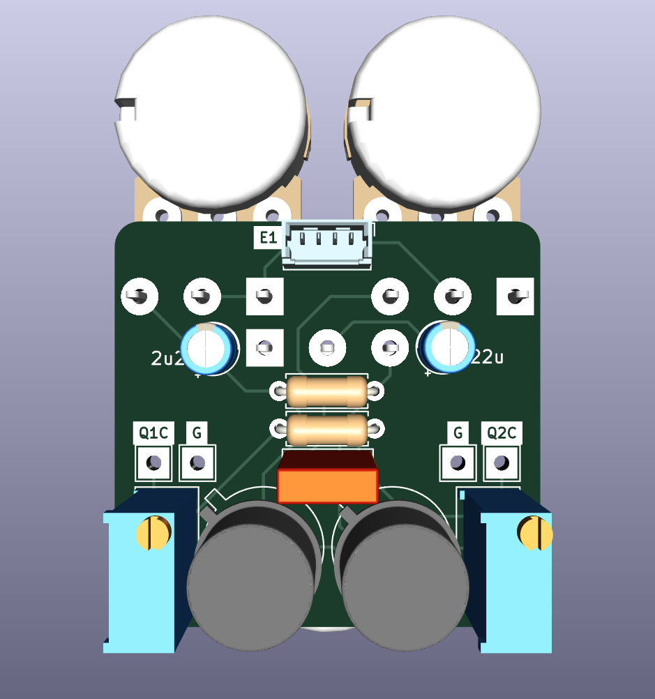

# Random Input Fuzz Effect

This is a re-creation of the original Dallas Arbiter Fuzz Face effect circuit, continuing my attempts to design guitar effects using [KiCAD](https://www.kicad.org/).

The resulting design is a product of breadboarding and experimentation after an initial build of the circuit. It emphasizes as ability to fine-tune the bias of each transistor to obtain a pleasant sound from a variety of NPN transistors (germanium or silicon). Besides this emphasis, it remains true to the original.

The circuit can be adapted for PNP transistors by reversing the supply voltage and polarity of electrolytic capacitors.

[Schematic](hardware/RandomInput_schematic_v0.1.pdf)

Instructions for biasing transistors (using the incorporated trimpots) are provided in the schematic. (This was the approach that worked for me, after a few hours of research. I'm by no means an expert and would welcome feedback.)

## Credit
The basic schematic I worked from is widely available on the internet. At the same time my research drew on analyses from far-greater experts than myself, as well as published circuit diagrams. Most notably:
[CODA Effects' circuit analysis](https://www.coda-effects.com/p/circuit-analysis-fuzz-face.html)
[RG Keen's analysis](http://www.geofex.com/article_folders/fuzzface/fffram.htm)
[PedalPCB Twin Face](https://www.pedalpcb.com/product/twinface/)

## BOM

TODO

## Assembly

The effect is designed to be assembled in a similar way to other PedalPCB effects, and is compatible with their [3PDT footswitch utility PCB](https://www.pedalpcb.com/product/3pdt/). More detailed instructions TODO, for now refer to PedalPCB instructions... and buy thier PCBs.

## Name
*The name "Random Input" is a reflection of the nature of the effect (a very basic fuzz) and security nerdery (fuzzing software using random input being a primitive technique to surface errors).*