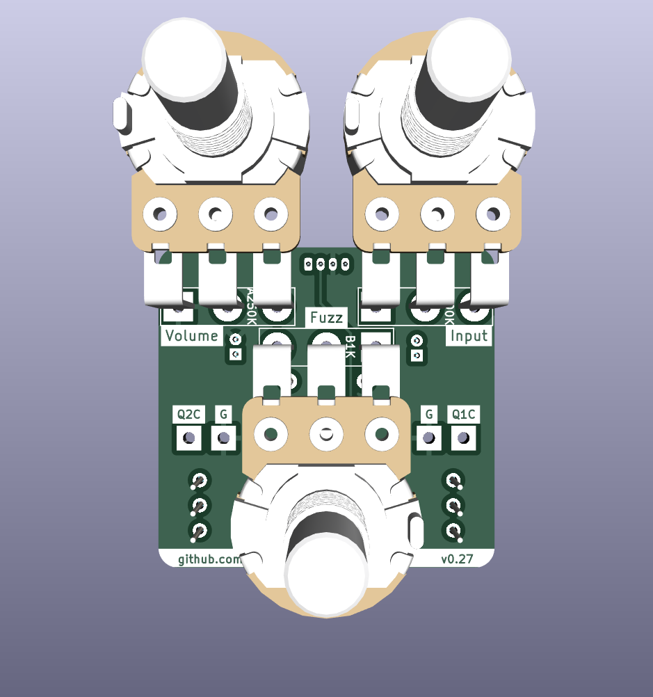

# Random Input Fuzz Effect

This is a re-creation of the original Dallas Arbiter Fuzz Face effect circuit, continuing my attempts to design guitar effects using [KiCAD](https://www.kicad.org/).

The resulting design is a product of breadboarding and experimentation after an initial build of the original circuit. It emphasizes the ability to easily fine-tune the bias of each transistor to obtain a pleasant sound from a variety of NPN transistors (germanium or silicon). Besides this emphasis, it remains true to the original.

The board is built on the ["Noise Floor"](https://github.com/whbeers/noise_floor) pedal platform, which provides basic power protection, audio IO, and a footswitch with LED indicator.

[Schematic PDF](schematics/random_input-latest.pdf)

Instructions for biasing transistors (using the incorporated trimpots) are provided in the schematic. (This was the approach that worked for me, after a few hours of research. I'm by no means an expert and would welcome feedback.)

## Credit
The basic schematic I worked from is widely available on the internet. At the same time my research drew on analyses from far-greater experts than myself, as well as published circuit diagrams. Most notably:
 - [CODA Effects' circuit analysis](https://www.coda-effects.com/p/circuit-analysis-fuzz-face.html)
 - [RG Keen's analysis](http://www.geofex.com/article_folders/fuzzface/fffram.htm)
 - [PedalPCB Twin Face](https://www.pedalpcb.com/product/twinface/)

Thanks as always to the folks on the [freestompboxes.org](https://www.freestompboxes.org/) forum for feedback and suggestions.

Potentiometer 3D model courtesy [Vasily Kashirin](https://grabcad.com/vasily.kashirin-1).

*I am not affiliated with any of the brands, sites, or products named in this overview.*

## Versioning

My pcb designs utilize the following versioning scheme (I'll add to this as I produce more revisions):
 - v0.0XX: A candidate design that has not yet been produced and tested.
 - v0.XX: A design that has been produced, tested, and any initial errors addressed.

## Name
*The name "Random Input" is a reflection of the nature of the effect (a very basic fuzz) and security nerdery (fuzzing software using random input being a primitive technique to surface errors).*
